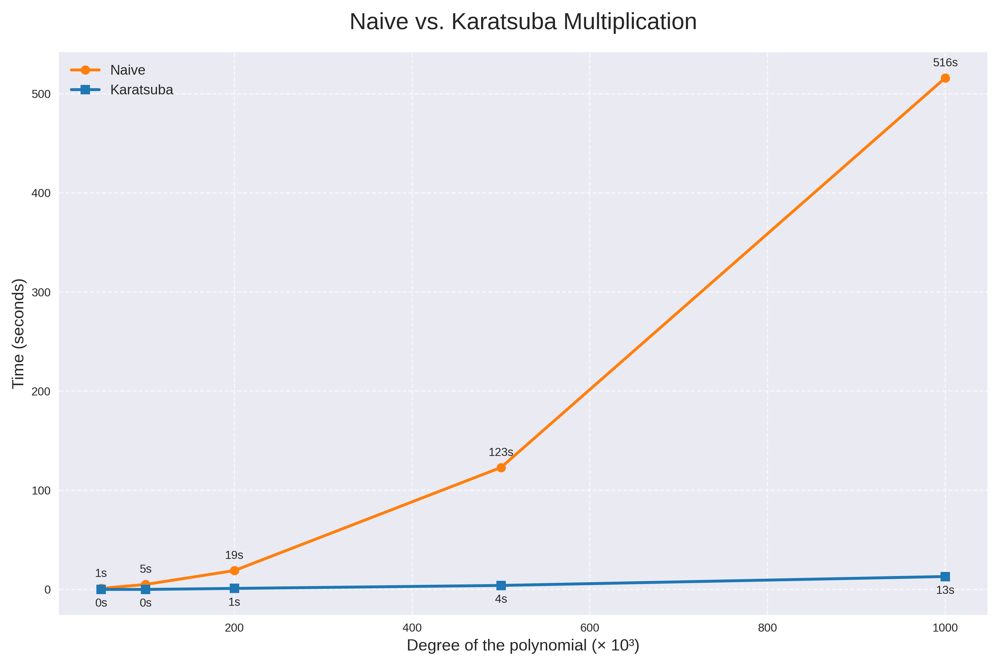

## Karatsuba
This repository contains a basic implementation in C of the Karatsuba algorithm for multiplying two polynomials in $\mathbb{Z}/2^{32}\mathbb{Z}$ of the same degree.

### How it works?
Given two polynomials $P$ and $Q$ in $\mathbb{Z}/2^{32}\mathbb{Z}$ of degree $d$.
$P$ and $Q$ are split into $P_0(X) + X^n P_1(X)$ and $Q_0(X) + X^n Q_1(X)$ respectively.
Then, we consider the following three (intermediate) polynomials:

- $A(X) = P_0(X) \times Q_0(X)$
- $B(X) = (P_0(X) + P_1(X)) \times (Q_0(X) + Q_1(X))$
- $C(X) = P_1(X) \times Q_1(X)$

Finally, the result of the multiplication, a polynomial of degree $2d$ (let us call it $R$), can be constructed using the fact that $R(X) = A + X^n(B-(A+C)) + X^{2n} C$

### Performance:
Below is a simple evaluation of this implementation compared to the naive algorithm.

The graph below shows the evolution of the time taken by each method to multiply two randomly-generated polynomials as their degrees increase.

The executable was compiled with the optimization flag `-O3`.
This plot was generated by filling $P$ and $Q$ with random coefficients in $[0, 2³¹]$ for various degrees (see x-axis). Please note that the degrees are in *thousands*.
These tests was carried out on a 12th Gen Intel Core i7-12700H with 16 GB RAM.

